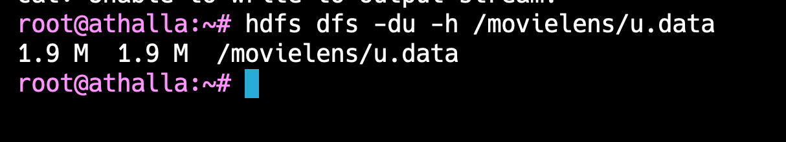

1. docker pull silicoflare/hadoop:amd
2. docker tag silicoflare/hadoop:amd hadoop
3. docker run -it -p 9870:9870 -p 8088:8088 -p 9864:9864 --name hadoop-container-2 hadoop
4. init
   
5. source ~/.bashrc

HADOOP

1. apt install unzip
2. wget https://files.grouplens.org/datasets/movielens/ml-100k.zip
3. unzip ml-100k.zip

4. hdfs dfs -mkdir /movielens

   

5. hdfs dfs -cat /movielens/u.data | head -n 10
   
6. hdfs dfs -du -h /movielens/u.data
   

PIG

```pig
-- Load data
ratings = LOAD '/movielens/u.data' USING PigStorage('\t')
          AS (user_id:int, item_id:int, rating:int, timestamp:long);

-- Hitung rata-rata rating per item
avg_rating = FOREACH (GROUP ratings BY item_id)
             GENERATE group AS item_id, AVG(ratings.rating) AS avg_rating;

-- Filter hanya yang rating >= 4.0
film_favorit = FILTER avg_rating BY avg_rating >= 4.0;

-- Simpan ke HDFS
STORE film_favorit INTO '/output/film_favorit' USING PigStorage(',');
```


HIVE

notes:
`schematool -initSchema -dbType derby`
misal error lakukan:
`rm -rf metastore_db derby.log`

1. hive --service metastore
2. hive
   
   
   

```sql
-- 1. Buat database
CREATE DATABASE movielens;
USE movielens;

-- 2. Buat tabel
CREATE TABLE ratings (
  `user_id` INT,
  `item_id` INT,
  `rating` INT,
  `timestamp` BIGINT
)
ROW FORMAT DELIMITED
FIELDS TERMINATED BY '\t';

-- 3. Load data (pastikan file-nya ada di path lokal HDFS)
LOAD DATA INPATH '/movielens/u.data' INTO TABLE ratings;

-- 4. Hitung rata-rata rating per film
CREATE VIEW avg_ratings AS
SELECT item_id, AVG(rating) AS avg_rating
FROM ratings
GROUP BY item_id;

-- 5. Ambil 10 film dengan rating tertinggi
SELECT * FROM avg_ratings
ORDER BY avg_rating DESC
LIMIT 10;
```
